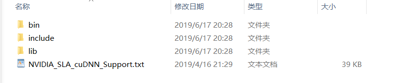
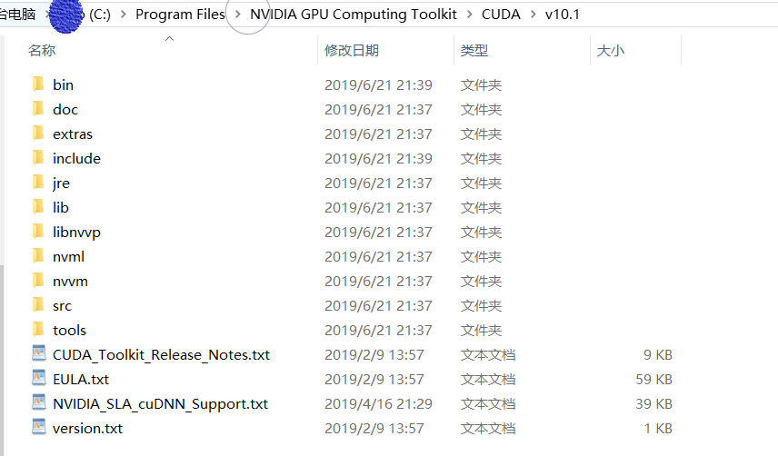
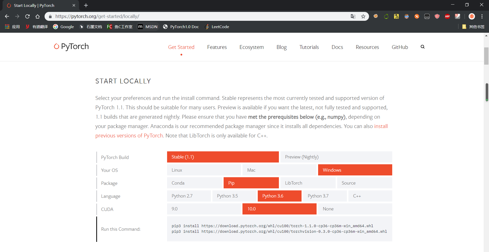
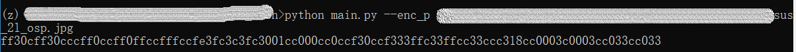
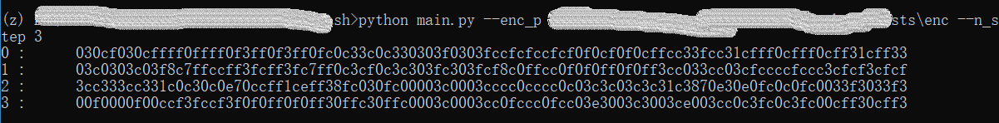
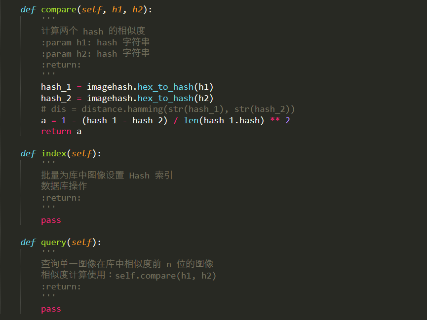
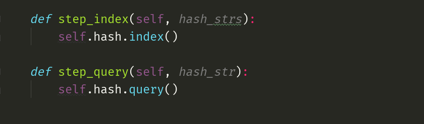
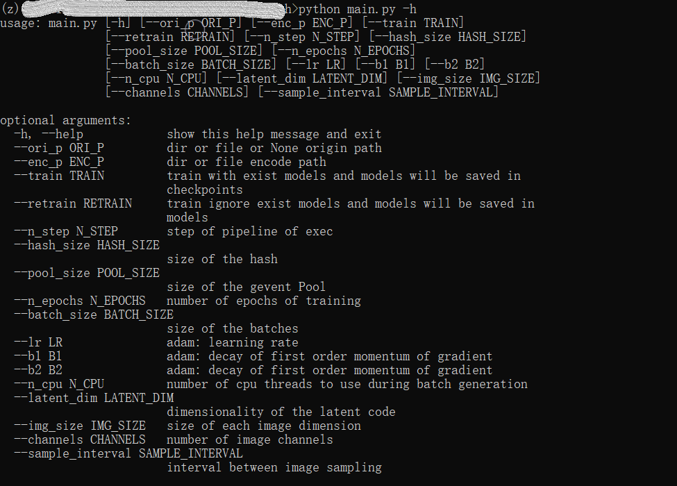
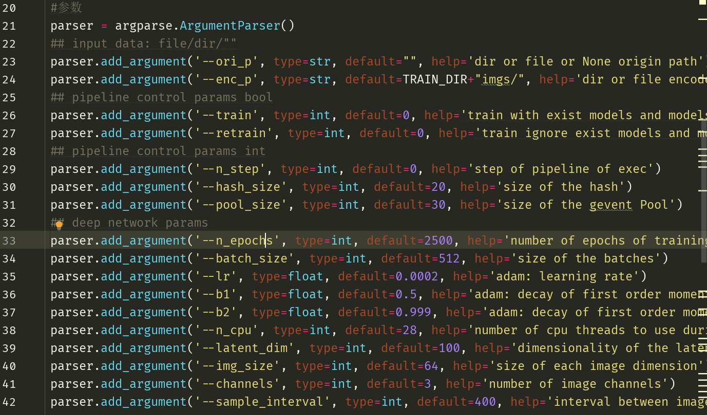

# aae_hash

base AAE and Hash, image match

## 功能介绍

1. 预处理
   1. 批量预处理
   2. 单图预处理
2. 图像自编码
   1. 批量自编码
   2. 单图自编码
3. 特征 hash
   1. 批量 hash
   2. 单图 hash
4. 训练
   1. 重训练
   2. 预训练
5. 查询与索引
   1. 查询
   2. 索引
6. 工具
   1. 图像迁移

## 接口介绍

1. 输入单一图像，返回图像 Hash
2. 输入源图像路径，重训练/预训练模型
3. 输入源/已处理过图像路径，批量返回图像 Hash

## 环境配置

> 需要安装的 exe 文件放在 ../env/ 中
>
> 操作系统请使用 Windows10
>
> 如果配置电脑 GPU 为英伟达的从第一步开始，否则直接跳过第一步

1. 配置 Windows 10 SDKs、cuDA 以及 cuDNN

   1. 安装 winsdksetup.exe，一直摁下一步直到结束，重启

   2. 下载安装 cuDA 10.1、cuDNN 10.1

      1. 安装 cuDA，一直摁下一步
      2. 解压 cuDNN，将其中的文件（如图）拷贝到 cuDA 安装路径（如图）

      

      ​	

      

2. 安装 Pytorch 及相关包

   直接安装很慢，先翻墙开全局代理下载安装链接中的 whl 文件在本地安装，注意选择与自己电脑适配的版本，地址：<https://pytorch.org/get-started/locally/>

   

   3. 安装其他包

   ```
   pip install -r requirements.txt
   ```

   

## 接口使用

1. 单一图像 Hash

```
python main.py --enc_p <input_img_path>
```



2. 重训练

> 适用于优化模型，调整模型参数，每次都重新训练模型，模型保存路径为：./models/

```
python main.py --train 1 --retrain 1 --n_step 1
```


3. 预训练

> 适用于日常使用，默认加载保存在 ./models/checkpoints/ 中已训练好的模型，建议经常对checkpoints中的模型进行备份。

```
python main.py --train 1 --n_step 1
```


4. 输入源路径，批量返回图像 Hash

```
python main.py --ori_p <input_img_path> --n_step 3
```


5. 输入已处理图像路径，批量返回图像 Hash

```
python main.py --enc_p <input_img_path> --n_step 3
```



## 其他说明

1. 关于查询与索引，这个是数据库后台的任务，我不参与，不过我提供了两个函数，仅供参考，如图，代码位于 hash.Hash()：




当完成这两个函数之后，可以在 pipeline.Pipeline 中进行注册，如图

位置：pipeline.Pipeline.step_index(hash_strs)/step_query(hash_str)




位置：pipeline.Pipeline.schedule()


位置：pipeline.Pipeline.schedule()


2. 模型参数及其他参数

```
python main.py -h
```



或者，位置：main：




## 声明

1. 本项目，或者称为接口，由我一人开发 (__author__=TheFreer) ，商业使用请遵从 Apache2.0 协议，感谢配合。

2. 本人由于考研再没有时间参与此项目，不会对此接口做任何维护。
3. 对接口使用存在疑惑请在适当的时间联系我，感谢合作。
4. 关于代码注释，暂时没时间写注释，以后估计也没有。